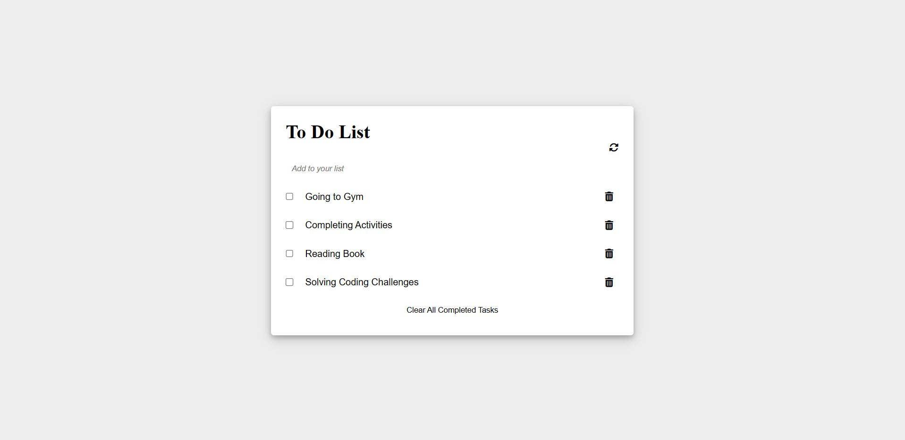

<a name="readme-top"></a>
<!-- TABLE OF CONTENTS -->

# 📗 Table of Contents

- [📖 About the Project](#about-project)
  - [🛠 Built With](#built-with)
    - [Tech Stack](#tech-stack)
    - [Key Features](#key-features)
  - [🚀 Live Demo](#live-demo)
- [💻 Getting Started](#getting-started)
  - [Setup](#setup)
  - [Prerequisites](#prerequisites)
  - [Install](#install)
  - [Usage](#usage)
  - [Run tests](#run-tests)
  - [Deployment](#triangular_flag_on_post-deployment)
- [👥 Authors](#authors)
- [🔭 Future Features](#future-features)
- [🤝 Contributing](#contributing)
- [⭐️ Show your support](#support)
- [🙏 Acknowledgements](#acknowledgements)
- [❓ FAQ (OPTIONAL)](#faq)
- [📝 License](#license)

<!-- PROJECT DESCRIPTION -->

# 📖 Awesome Books <a name="about-project"></a>

**To Do List** is a a small project that you can your days to dos inside it, and also delete it if you want. This project is made with HTML, CSS, and JavaScript.

</img>

## 🛠 Built With <a name="built-with"></a>

### Tech Stack <a name="tech-stack"></a>

<details>
  <summary>Client</summary>
  <ul>
    <li><a href="https://reactjs.org/">Html</a></li>
        <li><a href="#">CSS</a></li>
  </ul>
</details>

<!-- Features -->


### Key Features <a name="key-features"></a>

- **Add Book**
- **Remove Book**
- **Display Book**

<p align="right">(<a href="#readme-top">back to top</a>)</p>

<!-- LIVE DEMO -->

## 🚀 Live Demo <a name="live-demo"></a>

- [Live Demo Link](https://batoorsohail.github.io/to-do-list/dist/)

<p align="right">(<a href="#readme-top">back to top</a>)</p>

<!-- GETTING STARTED -->

## 💻 Getting Started <a name="getting-started"></a>


To get a local copy up and running, follow these steps.

### Prerequisites

In order to run this project you need:


```sh
 npm install
```


### Setup

Clone this repository to your desired folder:


Example commands:

```sh
  cd my-folder
  git clone https://github.com/batoorsohail/to-do-list.git
```
-

### Install

Install this project with:


### Usage

To run the project, execute the following command:


### Run tests

To run tests, run the following command:


### Deployment

You can deploy this project using:


<p align="right">(<a href="#readme-top">back to top</a>)</p>

<!-- AUTHORS -->

## 👥 Authors <a name="authors"></a>

👤 **Batoor Sohail**

- GitHub: [@batoorsohail](https://github.com/batoorsohail)
- Twitter: [@twitter](https://twitter.com/sohailBatoor)
- LinkedIn: [LinkedIn](https://www.linkedin.com/in/sohail-batoor-52429b230/)

<p align="right">(<a href="#readme-top">back to top</a>)</p>

<!-- FUTURE FEATURES -->

## 🔭 Future Features <a name="future-features"></a>


- [ ] **Navigation bar**
<p align="right">(<a href="#readme-top">back to top</a>)</p>

<!-- CONTRIBUTING -->

## 🤝 Contributing <a name="contributing"></a>

Contributions, issues, and feature requests are welcome!

Feel free to check the [issues page](../../issues/).

<p align="right">(<a href="#readme-top">back to top</a>)</p>

<!-- SUPPORT -->

## ⭐️ Show your support <a name="support"></a>

If you like this project please give it a ⭐️

<p align="right">(<a href="#readme-top">back to top</a>)</p>

<!-- ACKNOWLEDGEMENTS -->

## 🙏 Acknowledgments <a name="acknowledgements"></a>

I would like to thank every one who helped me during this project.

<p align="right">(<a href="#readme-top">back to top</a>)</p>


<p align="right">(<a href="#readme-top">back to top</a>)</p>

<!-- LICENSE -->

## 📝 License <a name="license"></a>

This project is [MIT](https://github.com/batoorsohail/to-do-list/blob/interactiveList/LICENSE.MD) licensed.

<p align="right">(<a href="#readme-top">back to top</a>)</p>
